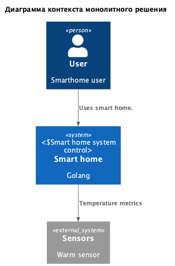
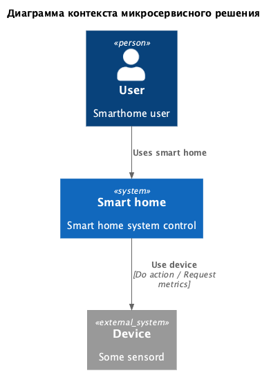
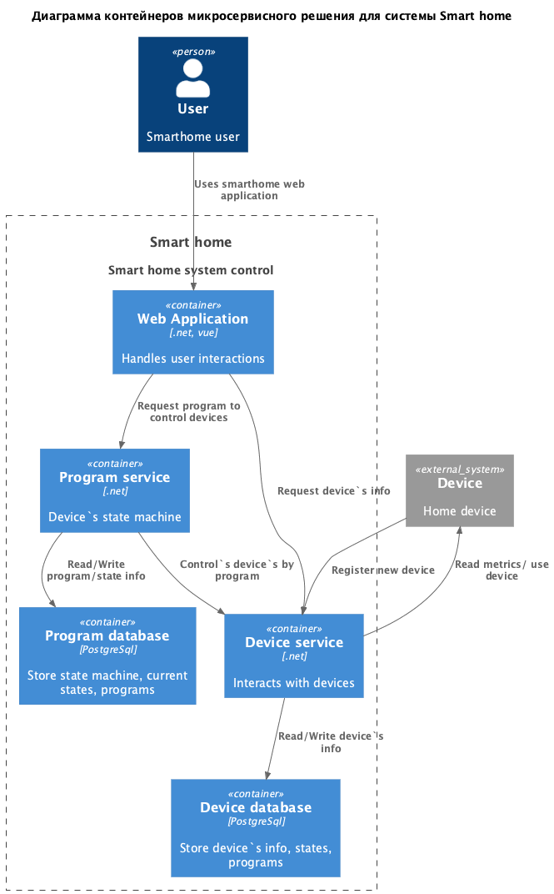

# Project_template

Это шаблон для решения проектной работы. Структура этого файла повторяет структуру заданий. Заполняйте его по мере работы над решением.

# Задание 1. Анализ и планирование


### 1. Описание функциональности монолитного приложения

```комментари
Работа с приложением:
- проверить работоспособность api

Работа с сенсорами: 
- посмотреть всю информацию по всем доступным сенсорам
- посмотреть информацию по конкретному сервису
- добавить новый сенсор 
- обновить описание сенсора
- удалить существующий сенсор
- обновить показания сенсора
- получить данные с показателя сенсоров по локации
- получить данные с показателя сенсоров по идентификатору сенсора
```

* Настройка умного дома:
	- возможность добавлять новые дадчики
	- удалять старые дадчики
	- изменять описание дадчиков 

* Управление отоплением:
	- Пользователь может удалённо включать/выключать отопление в своих домах.
	- Пользователь может просматривать показатели датчиков


### 2. Анализ архитектуры монолитного приложения

- Язык программирования: Golang
- База данных: Postgres
- Архитектура: монолитное приложение, в котором вся обработка запросов, бизнес-логика, работа с данными выполняется в рамках одного приложения. 
- Взаимодействие: Синхронное, запросы обрабатываются последовательно.
- Масштабируемость: Полная остановка приложения на время деплоя, для масштабирования одного компонента, нужно работать со всем приложением целиком
- Развертывание: Требует остановки всего приложения.

### 3. Определение доменов и границы контекстов

- Домен: Умный дом
	- Поддомен: настройка датчиков
		- контекст: добавление датчика
		- контекст: удаление датчика
	- Поддомен: мониторинг температуры
		- контекст: получение показателей датчика температуры
	- Поддомен: управление отоплением
		- контекст: регулирование отопления 


### **4. Проблемы монолитного решения**

- Трудность масштабирования: Приложение ориентировано только на работу с датчиками температуры. Для внедрения новых показателей, нужно будет значительно переделать систему
- Трудность развертывания: Для масштабирования данного решения, специалистам придется ездить в каждый дом для обновления приложения
- Трудность сопровождения/поддержки: Каждый раз для установки системы нужно выезжать специалисту и устанавливать систему, подключать датчики


### 5. Визуализация контекста системы — диаграмма С4
- [контекста системы — диаграмма С4](./schemas/context/monolit.puml)

 

# Задание 2. Проектирование микросервисной архитектуры

В этом задании вам нужно предоставить только диаграммы в модели C4. Мы не просим вас отдельно описывать получившиеся микросервисы и то, как вы определили взаимодействия между компонентами To-Be системы. Если вы правильно подготовите диаграммы C4, они и так это покажут.
**Диаграмма контекстов (Contexts)**

- [контекста системы — диаграмма С4](./schemas/context/microservice.puml)

 

**Диаграмма контейнеров (Containers)**

- [контейнеры системы — диаграмма С4](./schemas/container/microservice.puml)

 

**Диаграмма компонентов (Components)**

- [компоненты системы — диаграмма С4](./schemas/component/microservice.puml)

 

**Диаграмма кода (Code)**

- [код устройства — диаграмма С4](./schemas/code/device.puml)

 

- [код машины состония диаграмма С4](./schemas/code/machinestate.puml)

 

# Задание 3. Разработка ER-диаграммы

Добавьте сюда ER-диаграмму. Она должна отражать ключевые сущности системы, их атрибуты и тип связей между ними.


========================================================================================================
========================================================================================================
========================================================================================================
===================================== Дальше еще не сделано  ============================================
========================================================================================================
========================================================================================================
========================================================================================================
========================================================================================================


# Задание 4. Создание и документирование API

### 1. Тип API

Укажите, какой тип API вы будете использовать для взаимодействия микросервисов. Объясните своё решение.

### 2. Документация API

Здесь приложите ссылки на документацию API для микросервисов, которые вы спроектировали в первой части проектной работы. Для документирования используйте Swagger/OpenAPI или AsyncAPI.

# Задание 5. Работа с docker и docker-compose

Перейдите в apps.

Там находится приложение-монолит для работы с датчиками температуры. В README.md описано как запустить решение.

Вам нужно:

1) сделать простое приложение temperature-api на любом удобном для вас языке программирования, которое при запросе /temperature?location= будет отдавать рандомное значение температуры.

Locations - название комнаты, sensorId - идентификатор названия комнаты

```
	// If no location is provided, use a default based on sensor ID
	if location == "" {
		switch sensorID {
		case "1":
			location = "Living Room"
		case "2":
			location = "Bedroom"
		case "3":
			location = "Kitchen"
		default:
			location = "Unknown"
		}
	}

	// If no sensor ID is provided, generate one based on location
	if sensorID == "" {
		switch location {
		case "Living Room":
			sensorID = "1"
		case "Bedroom":
			sensorID = "2"
		case "Kitchen":
			sensorID = "3"
		default:
			sensorID = "0"
		}
	}
```

2) Приложение следует упаковать в Docker и добавить в docker-compose. Порт по умолчанию должен быть 8081

3) Кроме того для smart_home приложения требуется база данных - добавьте в docker-compose файл настройки для запуска postgres с указанием скрипта инициализации ./smart_home/init.sql

Для проверки можно использовать Postman коллекцию smarthome-api.postman_collection.json и вызвать:

- Create Sensor
- Get All Sensors

Должно при каждом вызове отображаться разное значение температуры

Ревьюер будет проверять точно так же.


# **Задание 6. Разработка MVP**

Необходимо создать новые микросервисы и обеспечить их интеграции с существующим монолитом для плавного перехода к микросервисной архитектуре. 

### **Что нужно сделать**

1. Создайте новые микросервисы для управления телеметрией и устройствами (с простейшей логикой), которые будут интегрированы с существующим монолитным приложением. Каждый микросервис на своем ООП языке.
2. Обеспечьте взаимодействие между микросервисами и монолитом (при желании с помощью брокера сообщений), чтобы постепенно перенести функциональность из монолита в микросервисы. 

В результате у вас должны быть созданы Dockerfiles и docker-compose для запуска микросервисов. 