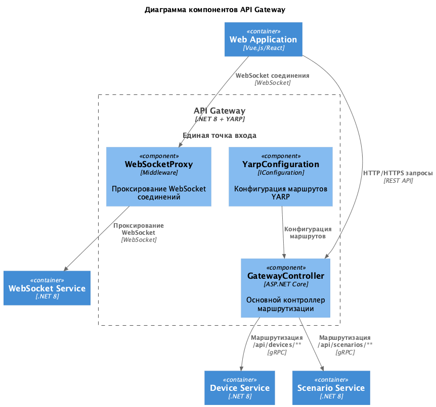
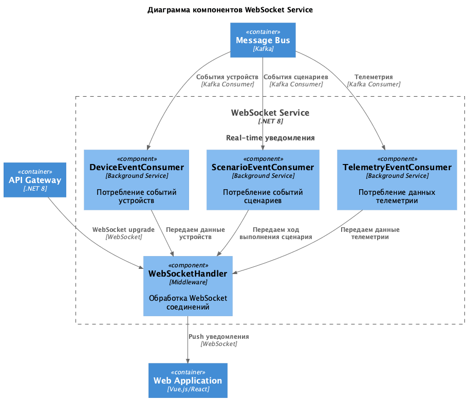
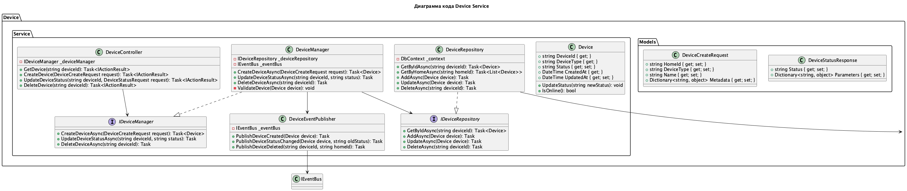
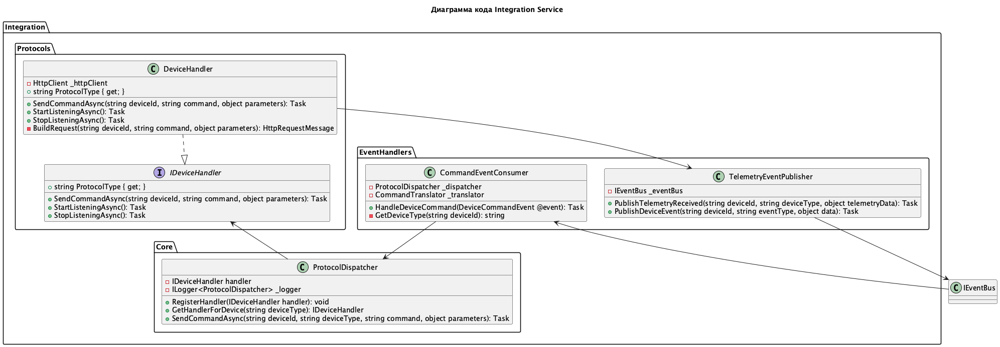
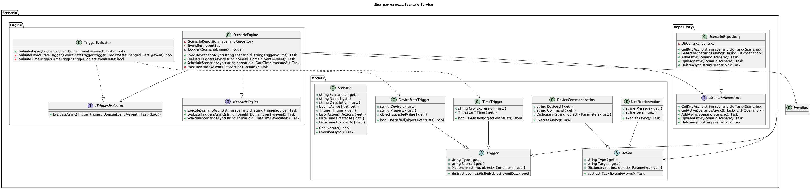
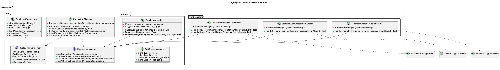
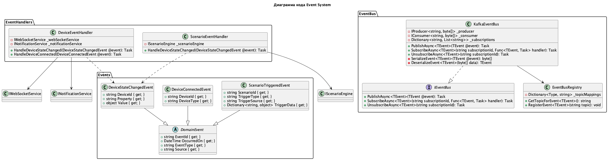
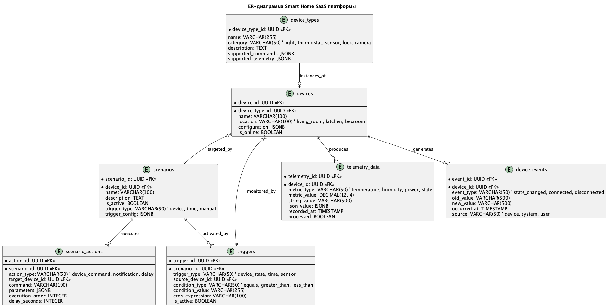

# Project_template

Это шаблон для решения проектной работы. Структура этого файла повторяет структуру заданий. Заполняйте его по мере работы над решением.

# Задание 1. Анализ и планирование


### 1. Описание функциональности монолитного приложения

```комментари
Работа с приложением:
- проверить работоспособность api

Работа с сенсорами: 
- посмотреть всю информацию по всем доступным сенсорам
- посмотреть информацию по конкретному сервису
- добавить новый сенсор 
- обновить описание сенсора
- удалить существующий сенсор
- обновить показания сенсора
- получить данные с показателя сенсоров по локации
- получить данные с показателя сенсоров по идентификатору сенсора
```

* Настройка умного дома:
	- возможность добавлять новые дадчики
	- удалять старые дадчики
	- изменять описание дадчиков 

* Управление отоплением:
	- Пользователь может удалённо включать/выключать отопление в своих домах.
	- Пользователь может просматривать показатели датчиков


### 2. Анализ архитектуры монолитного приложения

- Язык программирования: Golang
- База данных: Postgres
- Архитектура: монолитное приложение, в котором вся обработка запросов, бизнес-логика, работа с данными выполняется в рамках одного приложения. 
- Взаимодействие: Синхронное, запросы обрабатываются последовательно.
- Масштабируемость: Полная остановка приложения на время деплоя, для масштабирования одного компонента, нужно работать со всем приложением целиком
- Развертывание: Требует остановки всего приложения.

### 3. Определение доменов и границы контекстов

- Домен: Умный дом
	- Поддомен: настройка датчиков
		- контекст: добавление датчика
		- контекст: удаление датчика
	- Поддомен: мониторинг температуры
		- контекст: получение показателей датчика температуры
	- Поддомен: управление отоплением
		- контекст: регулирование отопления 


### **4. Проблемы монолитного решения**

- Трудность масштабирования: Приложение ориентировано только на работу с датчиками температуры. Для внедрения новых показателей, нужно будет значительно переделать систему
- Трудность развертывания: Для масштабирования данного решения, специалистам придется ездить в каждый дом для обновления приложения
- Трудность сопровождения/поддержки: Каждый раз для установки системы нужно выезжать специалисту и устанавливать систему, подключать датчики


### 5. Визуализация контекста системы — диаграмма С4
- [контекста системы — диаграмма С4](./schemas/context/monolit.puml)

 

# Задание 2. Проектирование микросервисной архитектуры

В этом задании вам нужно предоставить только диаграммы в модели C4. Мы не просим вас отдельно описывать получившиеся микросервисы и то, как вы определили взаимодействия между компонентами To-Be системы. Если вы правильно подготовите диаграммы C4, они и так это покажут.
**Диаграмма контекстов (Contexts)**

- [контекста системы — диаграмма С4](./schemas/context/microservice.puml)

 

**Диаграмма контейнеров (Containers)**

- [контейнеры системы — диаграмма С4](./schemas/container/microservice.puml)

 

**Диаграмма компонентов (Components)**

## ApiGateway

- [компоненты apigateway диаграмма С4](./schemas/component/apigateway.puml)

 

 ## DeviceService

- [компоненты DeviceService диаграмма С4](./schemas/component/DeviceService.puml)

 

 ## WebSocket service

- [компоненты WebSocket диаграмма С4](./schemas/component/websocket.puml)

 

 ## ScenarioService

- [компоненты ScenarioService диаграмма С4](./schemas/component/ScenarioService.puml)

 

 ## Integration service

- [компоненты Integration service диаграмма С4](./schemas/component/Integrationservice.puml)

 

**Диаграмма кода (Code)**

## Device service code

- [код Device service диаграмма С4](./schemas/code/deviceservice.puml)

 

## Integartion service code

- [код Integartion service диаграмма С4](./schemas/code/integrationservice.puml)

 

## Scenarion service code

- [код Scenarion диаграмма С4](./schemas/code/scenarioservice.puml)

 


## WebSocket service code

- [код WebSocket диаграмма С4](./schemas/code/websocket.puml)

 


## Event system service code

- [код машины состония диаграмма С4](./schemas/code/eventsystem.puml)

 

# Задание 3. Разработка ER-диаграммы

 

# Задание 4. Создание и документирование API

### 1. Тип API

Для начально решения подойдет RestApi, которое позволит постепенно уйти от монолитного решения. В дальнейшем можно перейти на asyncApi, чтобы не выполнять постоянный опрос сервисов, а реагировать на изменение покателей устройств. 

Плюсы:
 - повысит отказоустойчивость и уменьшит связанность между сервисами. 
 - повышание масштабирования системы


### 2. Документация API

- [DeviceService AsyncApi](./doc/asyncDeviceApi.yml)
- [DeviceService SwaggerApi](./doc/deviceServiceSwagger.json)

# Задание 5. Работа с docker и docker-compose

 [Исходники сервиса](./microservices/temperature-api/)

# **Задание 6. Разработка MVP**

Необходимо создать новые микросервисы и обеспечить их интеграции с существующим монолитом для плавного перехода к микросервисной архитектуре. 

### **Что нужно сделать**

1. Создайте новые микросервисы для управления телеметрией и устройствами (с простейшей логикой), которые будут интегрированы с существующим монолитным приложением. Каждый микросервис на своем ООП языке.
2. Обеспечьте взаимодействие между микросервисами и монолитом (при желании с помощью брокера сообщений), чтобы постепенно перенести функциональность из монолита в микросервисы. 

В результате у вас должны быть созданы Dockerfiles и docker-compose для запуска микросервисов. 